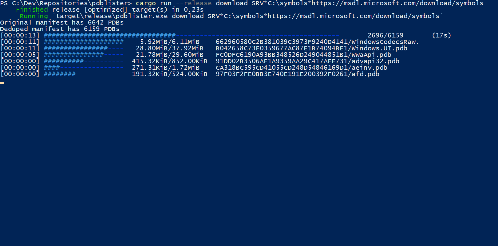

# Summary

This is a tiny project to be a quick alternative to symchk for generating
manifests. This mimics symchk of the form `symchk /om manifest /r <path>`
but only looks for MZ/PE files.

Due to symchk doing some weird things it can often crash or get stuck in
infinite loops. Thus this is a stricter (and much faster) alternative.

The output manifest is compatible with symchk. If you want to use symchk
in lieu of this tool, use `symchk /im manifest /s <symbol path>`

Note that we currently offer **no guarantee of stability** for the
command-line options of this tool. If you need stability, please install a
specific version.



# Quick Start

```
# On your target
> cargo run --release -- manifest C:\Windows\System32

# On an online machine
> cargo run --release -- download SRV*C:\Symbols*https://msdl.microsoft.com/download/symbols
```

# Future

More configuration could be done through command line parameters. Such as
number of threads for downloads and symbol paths.

Randomizing the order of the files in the manifest would make downloads more
consistant by not having any filesystem locality bias in the files.

Deduping the files in the manifests could also help, but this isn't a big
deal *shrug*

# Performance

This tool tries to do everything in memory if it can. Lists all files first
then does all the parsing (this has random accesses to files without mapping so
it could be improved, but it doesn't really seem to be an issue, this random
access only occurs if it sees an MZ and PE header and everything is valid).

It also generates the manifest in memory and dumps it out in one swoop, this is
one large bottleneck original symchk has.

Then for downloads it chomps through a manifest file asynchronously, at up to
16 files at the same time! The original `symchk` only peaks at about 3-4 Mbps
of network usage, but this tool saturates my internet connection at
400 Mbps.

Look how damn fast this stuff is!

```
On an offline machine:

PS C:\users\pleb\Downloads> .\pdblister.exe clean
Time elapsed: 0 seconds
PS C:\users\pleb\Downloads> .\pdblister.exe manifest C:\
Generating file listing...
Done!
Parsed 398632 of 398632 files (23051 pdbs)
Time elapsed: 104 seconds

On an online machine:
C:\dev\pdblister>cargo run --release download
    Finished release [optimized] target(s) in 0.0 secs
     Running `target\release\pdblister.exe download`
Trying to download 23051 PDBs
Time elapsed: 120 seconds
```

